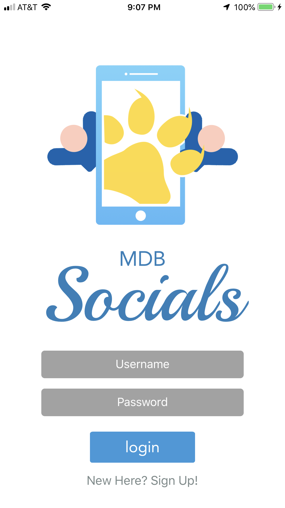
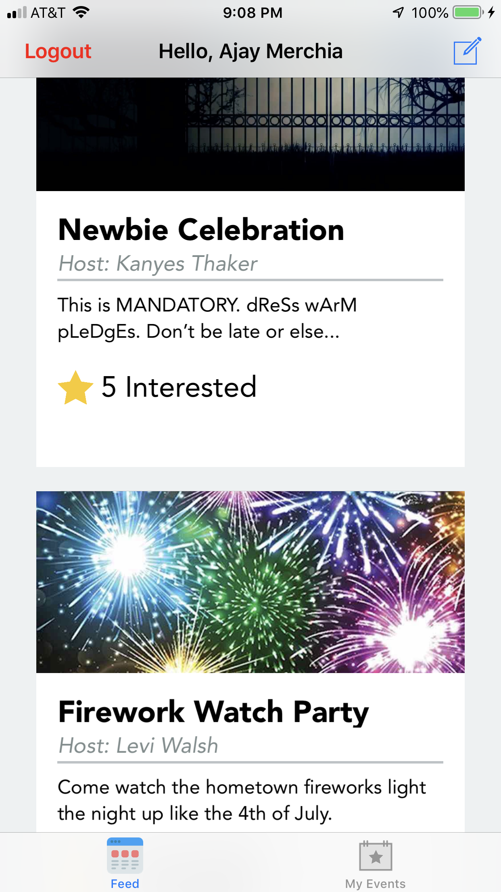
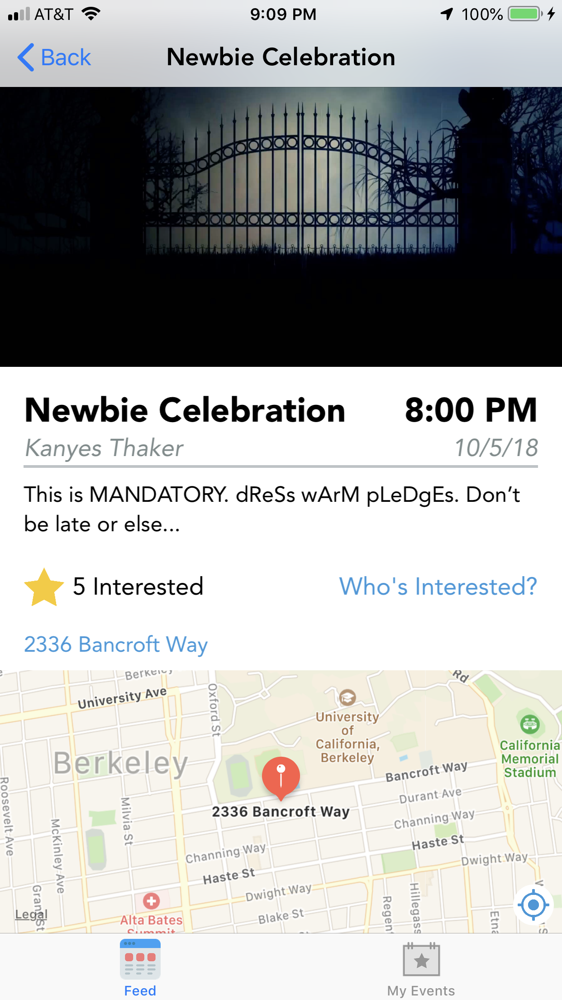
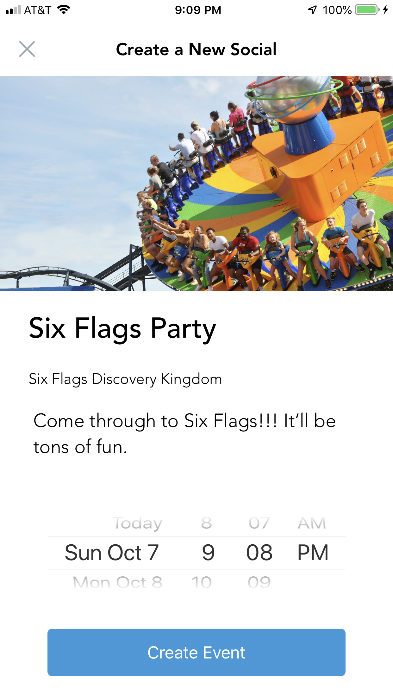

# MDB Socials Part 2

## Description
This is MDB Socials reinvented. Not only does it have all the functionality of [MDB Socials Part 1](https://github.com/ajaymerchia/mdb_mp3_socials), it also allows users to include the location of an event. Furthermore, when users mark interest in an event, or create one, they can access it in the "My Events" tab. Users can now also include a profile picture with their account, which will be shown in the guest list views associated with each event. Lastly, people can get Lyft estimates to an MDB social and navigate to the app to book them.

## Screenshots
### MDB Socials: The Second

|         |            |   |
| :-------------: | :-------------: | :-------------: |
| Sign Up | Social Feed | Event Details |

|         |            |   |
| :-------------: | :-------------: | :-------------: |
| Create Events | View Guest Lists | Get Transportation |
